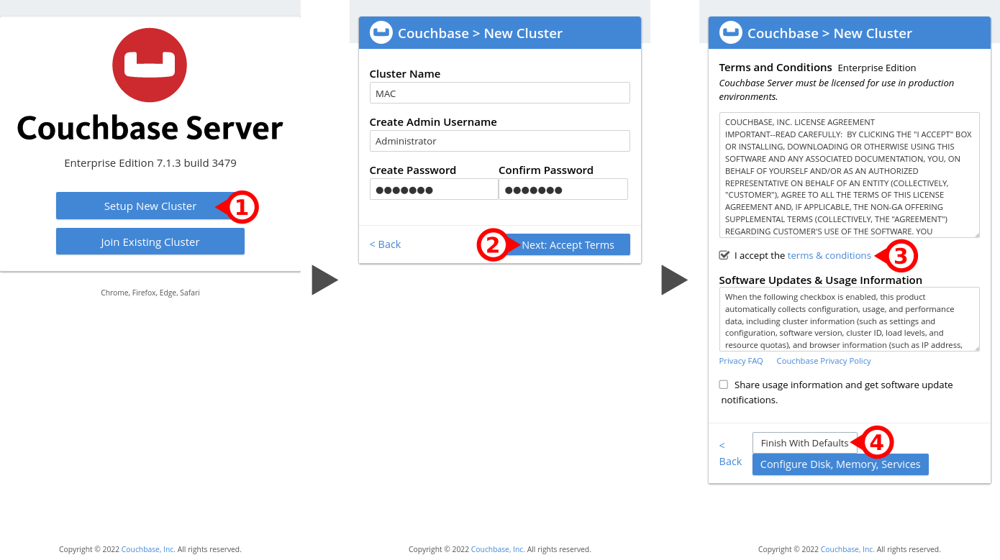
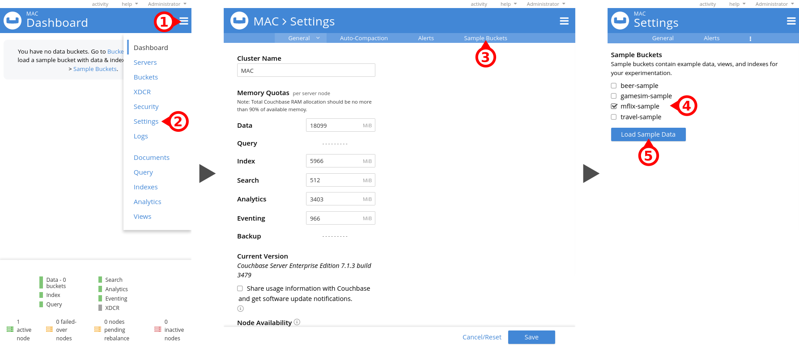

= Installation Couchbase
Nastaran FATEMI <nastaran.fatemi@heig-vd.ch>; Christopher MEIER <christopher.meier@heig-vd.ch>
:revdate: 17 septembre 2025
:lang: fr
:toc: auto
:toc-title: Table des matières
:course: Méthodes d’Accès aux Données (MAC)
:xrefstyle: short

== Introduction

Ce document explique comment installer la base de données _Couchbase_ en utilisant `docker compose`.

== Pré-requis

https://www.docker.com/products/docker-desktop/[Docker] doit être installé.

== Mise en place

Ouvrez un terminal dans le dossier actuel puis exécuter la commande: `docker compose up`. Ceci va télécharger l'image de Couchbase puis démarrer un container à partir de cette image.

TIP: Si le téléchargement de l'image échoue vous pouvez essayer de la créer vous même avec la commande `docker compose up --build`

=== Configuration initiale

Lors du premier lancement, configurez Couchbase à partir de son interface Web (disponible à l'adresse http://localhost:8091) pour créer un nouveau cluster. Vous pouvez utiliser les valeurs suivantes pour les champs qui n'ont pas de défaut :

.Valeurs de configuration
[cols="1,1"]
|===
|Cluster Name
|`MAC`

|Admin Username
|`Administrator`

|Password
|`mac2025`
|===

.Configuration du premier lancement

=== Dataset

Ce cours utilise un dataset appelé `mflix-sample`.

Son installation se fait depuis l'interface Web à la page `Settings > Sample Buckets`.

.Chargement du dataset

Le dataset s'installe dans le bucket `mflix-sample` et contient un scope `_default` qui contient 4 collections: `comments`, `movies`, `theaters` et `users`

Prenez le temps de vous familiariser avec la structures des différents documents (avec, par exemple, la clause `INFER` ou avec le xref:mflix_schema.asciidoc[document mflix_schema] fourni en annexe) ainsi qu'avec les index qui sont déjà créés.

[appendix]
== Questions fréquentes

[qanda]
Je n'ai pas suffisamment de mémoire vive lorsque je veux configurer le cluster::
À la place d'utiliser "Finish With Defaults", cliquez sur "Configure Disk, Memory, Services" puis désactiver les "Service Memory Quotas" pour "Analytics" et "Eventing".

Je ne veux pas utiliser docker::
Il n'est pas obligatoire d'utiliser docker, mais c'est à vous de régler les soucis d'installation éventuels. Une fois Couchbase installé, il faut copier le fichier `mflix-sample.zip` dans le dossier `samples` de votre installation.
