= Labo 2 - Neo4j
Nastaran FATEMI <nastaran.fatemi@heig-vd.ch>; Christopher MEIER <christopher.meier@heig-vd.ch>
:revdate: 7 octobre 2025
:lang: fr
:toc: auto
:toc-title: Table des matières
:course: Méthodes d’Accès aux Données (MAC)
:xrefstyle: short

== Introduction

=== Objectif

L'objectif de ce laboratoire est d'exercer la base de données graphe, Neo4j, et son langage de requête Cypher.

=== Organisation

Ce laboratoire est à effectuer par groupe de 2 étudiants. Tout plagiat sera sanctionné par la note de 1.

Ce laboratoire est à rendre avec un commit à la https://classroom.github.com/a/K5jTfOge[date indiquée sur Github Classroom].

=== Mise en place

Le code source du labo vous est fourni sur Github Classroom. Celui-ci contient :

* Un fichier `pom.xml` qui configure les dépendances du projet Maven.
* Un fichier `docker-compose.yml` qui permet le démarrage simplifié d'une instance de Neo4j.
* Un dossier `data` qui contient le jeu de données à utiliser pour ce labo.
* Un fichier `Main.java` qui se connecte à la base de donnée Neo4j et exécute les requêtes de `Requests.java`.
* Un fichier `QueryOutputFormatTest.java` qui permet de vérifier que vous avez le bon format d'output pour les requêtes. (Lancer les tests avant le rendu pour simplifier les tests automatiques de la correction)

Ainsi que le fichier à compléter :

* Un fichier `Requests.java`.

[NOTE]
====
Le driver pour Neo4j nécessite au minimum Java 17.
====

=== Déploiement

Nous vous recommandons d'utiliser le fichier `docker-compose.yml` fourni pour déployer une instance Neo4j avec le bon jeu de données :

 1. Ouvrez un terminal dans le dossier où vous avez les fichiers du labo.
 2. Exécutez la commande `docker compose up` pour importer le jeu de données et démarrer Neo4j.
 3. L'interface web est disponible à l'adresse http://localhost:7474
 4. Pour vous connecter, laissez le mot de passe vide.
 5. Chaque fois que vous faites `docker compose up`, le jeu de données est réimporté et les modifications éventuelles sont perdues. Si, après la première importation, vous souhaitez garder vos modifications, utilisez la commande `docker compose up graphdb`.

Les autres possibilités (à utiliser à vos risques et périls) :

 * Utiliser Neo4j Aura pour déployer une base de données gratuite sur le cloud.
 * Installer Neo4j Desktop nativement.

=== Dataset

Ce laboratoire utilise un jeu de données synthétique appelé *contact-tracing*.

Ce jeu de données contient 2 types de nœuds : `Person` (avec 501 nœuds) et `Place` (avec 101 nœuds). La <<figure-1>> montre les types de nœuds ainsi que les relations possibles.

Les <<table-1>> et <<table-2>> énumèrent les propriétés des nœuds et des relations.

[IMPORTANT]
====
Seul le dernier état de santé connu à la date du 2020-05-09 est enregistré pour les `Person`. Dans le cadre de ce labo, on suppose qu'une personne est malade tant qu'elle n'a pas effectué un test pour prouver son rétablissement.
====

[[figure-1]]
.Modèle du jeu de données contact-tracing

_Généré avec la requête ``CALL db.schema.visualization()``_

[NOTE]
====
La relation `FRIENDS_WITH` est symétrique : si A est ami avec B, alors B est aussi ami avec A.
====

[[table-1]]
.Propriétés des noeuds du jeu de données contact-tracing
[cols="3m,3m,2", options="header"]
|===
|Type de noeud |Nom de la propriété |Type de la propriété

|:Person |id |String
|:Person |confirmedtime |DateTime
|:Person |healthstatus |String
|:Person |name |String
|:Person |addresslocation |Point
|:Place |id |String
|:Place |name |String
|:Place |type |String
|:Place |homelocation |Point
|===

_Généré avec la requête ``CALL db.schema.nodeTypeProperties``_

[[table-2]]
.Propriétés des relations du jeu de données contact-tracing
[cols="3m,3m,2", options="header"]
|===
|Type de relation |Nom de la propriété |Type de la propriété

|:VISITS |id |String
|:VISITS |endtime |DateTime
|:VISITS |starttime |DateTime
|:VISITS |duration |Duration
|:FRIENDS_WITH |null |null
|===

_Généré avec la requête ``CALL db.schema.relTypeProperties``_

[NOTE]
====
La relation `FRIENDS_WITH` n'a pas de propriétés.
====

== Connexion

Vérifiez que vous pouvez vous connecter en exécutant la classe `Main`. Les noms des types de nœuds de contact-tracing devraient s'afficher dans votre console. Si besoin, modifiez la méthode `openConnection`.

== Indications

* Certaines requêtes demandent l'utilisation de paramètres. La https://neo4j.com/docs/java-reference/current/java-embedded/query-parameters/[documentation] contient quelques exemples pour vous aider. Il existe également https://neo4j.com/docs/api/java-driver/current/org.neo4j.driver/org/neo4j/driver/SimpleQueryRunner.html#run(java.lang.String,org.neo4j.driver.Value)[d'autres manières] d'exécuter une requête paramétrée.
* Afin de simplifier la correction, veuillez renommer les champs de retour de toutes vos requêtes pour correspondre aux noms entre parenthèses. Le nom des champs de retour est également vérifié par la suite de tests `QueryOutputFormatTest`.
* Placez correctement les `DISTINCT` pour obtenir le résultat souhaité.
* Toutes les requêtes peuvent et doivent être exécutées en une seule fois. Il n'y a donc pas de logique côté Java.
* Les réponses aux questions doivent être fournies sous forme de commentaires dans le code de la méthode correspondante.
* Pour les requêtes 1 et 2, il n'est pas nécessaire que les visites se chevauchent.

== Requêtes

=== 1. ⭐ possibleSpreaders

Implémentez la méthode `possibleSpreaders` qui retourne les noms de toutes les personnes malades (`sickName`) qui ont visité, après la confirmation de leur maladie, un lieu qu'une autre personne en bonne santé a fréquenté. La visite de la personne en bonne santé a commencé après la confirmation de son état de santé et après le début de la visite de la personne malade.

=== 2. ⭐ possibleSpreadCounts

Implémentez la méthode `possibleSpreadCounts` qui retourne, pour chaque personne malade, son nom (`sickName`) et le nombre de personnes en bonne santé (`nbHealthy`) qui ont fréquenté le même lieu qu'elle après la confirmation de sa maladie. La visite de la personne en bonne santé a commencé après la confirmation de son état de santé et après le début de la visite de la personne malade.

=== 3. ⭐ carelessPeople

Implémentez la méthode `carelessPeople` qui retourne le nom des personnes malades (`sickName`) qui ont fréquenté plus de 10 lieux différents après la confirmation de la maladie, ainsi que le nombre de lieux visités (`nbPlaces`). Triez par ordre décroissant du nombre de lieux.

=== 4. ⭐⭐ sociallyCareful

Sans utiliser `OPTIONAL MATCH`, implémentez la méthode `sociallyCareful1` qui retourne le nom des personnes malades (`sickName`) n’ayant jamais fréquenté un "Bar" après la confirmation de leur maladie. Les personnes n’ayant jamais visité de "Bar" doivent aussi apparaître dans le résultat.

Un LLM a proposé une variante avec `OPTIONAL MATCH`. Cette requête est-elle correcte ? Justifiez votre réponse et proposez une version corrigée (dans `sociallyCareful2`) si elle ne l’est pas.

[source,cypher]
----
   MATCH (p:Person {healthstatus: "Sick"})-[:VISITS]->(:Place{type:"Bar"})
OPTIONAL MATCH (p)-[v:VISITS]->(:Place{type:"Bar"})
   WHERE v.starttime > p.confirmedtime 
    WITH p, v
   WHERE v IS NULL
  RETURN p.name AS sickName
----

=== 5. ⭐⭐⭐ peopleToInform

Implémentez la méthode `peopleToInform` qui retourne, pour chaque personne malade, son nom (`sickName`), ainsi que la liste de toutes les personnes en bonne santé qu'elle risque d'avoir infectées (`peopleToInform`) avec la condition suivante : la personne malade a visité l'autre personne dans un endroit avec un chevauchement d'au moins 2 heures (après chacune de leurs confirmations).

* *Chevauchement :* La durée de chevauchement correspond à la différence entre le maximum des temps de début et le minimum des temps de fin des visites.
* *Astuce :* Utilisez les fonctions `apoc.coll.min` et `apoc.coll.max`.
* Voir la documentation sur les types temporels, particulièrement le type `duration`.

=== 6. ⭐⭐⭐ setHighRisk

Implémentez la méthode `setHighRisk` qui modifie la requête précédente (5) pour ajouter un attribut `risk = "high"` à toutes les personnes `peopleToInform` et qui retourne l'id et le nom des personnes (`highRiskId` et `highRiskName`) à haut risque.

=== 7. ⭐⭐ healthyCompanionsOf

Implémentez la méthode `healthyCompanionsOf` qui retourne le nom des personnes en bonne santé (`healthyName`) à une distance maximale de 3 visites d'une personne donnée. (Ex : Si A visite le même endroit que B et B visite le même endroit que C, alors A est à une distance de 2 visites de C).

=== 8. ⭐⭐ topSickSite

Implémentez la méthode `topSickSite` qui retourne le type de lieu (`placeType`) où il y a eu le plus de fréquentation des personnes malades (`nbOfSickVisits`) après leur confirmation. Retournez une seule valeur même s'il y a égalité.

=== 9. ⭐ sickFrom

Implémentez la méthode `sickFrom` qui retourne le nom des personnes malades (`sickName`) parmi une liste donnée.

=== 10. ⭐⭐ mutualFriends

Parmi les requêtes ci-dessous, lesquelles listent correctement tous les couples de personnes ayant au moins deux amis en commun ? Pour celles qui ne le font pas, expliquez la raison.

[cols="1,~"]
|===
.^|a
a|
[source,cypher]
----
 MATCH (a:Person)-[:FRIENDS_WITH]-(b:Person)-[:FRIENDS_WITH]-(c:Person)
 MATCH (a)-[:FRIENDS_WITH]-(d:Person)-[:FRIENDS_WITH]-(c)
 WHERE a > c
RETURN DISTINCT a.name, c.name
----

.^|b
a|
[source,cypher]
----
 MATCH (a:Person)-[:FRIENDS_WITH]-(b:Person)-[:FRIENDS_WITH]-(c:Person)-[:FRIENDS_WITH]-(d:Person)-[:FRIENDS_WITH]-(a)
 WHERE a > c
RETURN DISTINCT a.name, c.name
----

.^|c
a|
[source,cypher]
----
 MATCH (a:Person)-[:FRIENDS_WITH]->(b:Person)-[:FRIENDS_WITH]->(c:Person)<-[:FRIENDS_WITH]-(d:Person)<-[:FRIENDS_WITH]-(e)
 WHERE a > c AND e = a AND b <> d
RETURN DISTINCT a.name, c.name
----
|===

=== 11. ⭐⭐ indirectFriends

Listez les couples (A, B) qui ne sont pas amis directs, mais qui sont connectés par une chaîne d’amis comprenant jusqu’à 5 personnes intermédiaires.

Pour chaque requête ci-dessous, précisez si elle ne correspond pas et, le cas échéant, donnez un contre-exemple qui montre l’erreur.

[cols="1,~"]
|===
.^|a
a|
[source,cypher]
----
 MATCH (pA:Person)-[:FRIENDS_WITH]-(pB:Person)-[:FRIENDS_WITH*..5]->(pC:Person)
 WHERE pA > pC AND pB <> pC
RETURN DISTINCT pA.name, pC.name
----

.^|b
a|
[source,cypher]
----
 MATCH (pA:Person)-[:FRIENDS_WITH*2..6]-(pB:Person)
 WHERE pA > pB AND NOT (pA)-[:FRIENDS_WITH]-(pB)
RETURN DISTINCT pA.name, pB.name
----

.^|c
a|
[source,cypher]
----
 MATCH f = (pA:Person)-[:FRIENDS_WITH*..6]-(pB:Person)
  WITH pA, pB, MIN(LENGTH(f)) AS fs
 WHERE fs > 1 AND pA > pB
RETURN pA.name, pB.name
----
|===
