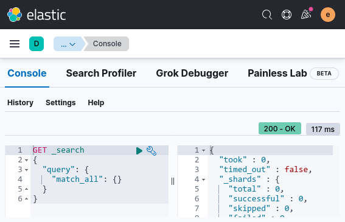
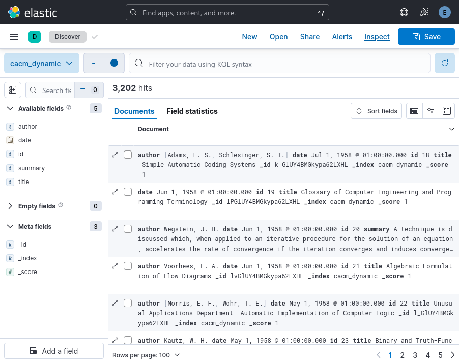

= Getting started with Elasticsearch
Nastaran FATEMI <nastaran.fatemi@heig-vd.ch>; Christopher MEIER <christopher.meier@heig-vd.ch>
:revdate: 12 November 2025
:lang: en
:toc: auto
:course: Méthodes d’Accès aux Données (MAC)
:xrefstyle: short

== Introduction
=== Objectives

The goal of this document is to install _Elasticsearch_, a distributed RESTful search engine widely used in industry and based on Apache Lucene (a free and open-source information retrieval software library), and to upload and parse a dataset.

=== Organization

There is no submission for this part. However, all the steps are required to complete the next lab, which will consist of indexing and searching the uploaded dataset.

=== Setup

The repo contains:

* ``data/``
** ``cacm.txt``: CACM collection, see <<Description of the collection>>.
** ``cacm.ndjson``: CACM collection formatted as line-separated JSON objects for easy ingestion.
** ``common_words.txt``: list of words that can commonly be removed (stop words — used in the next lab).
* ``docker-compose.yml``: correctly configured Docker deployment so that:
** Kibana can securely communicate with _Elasticsearch_.
** At least one node in the cluster must have the role ``ingest``; this is one of the https://www.elastic.co/guide/en/elasticsearch/reference/current/modules-node.html#node-roles[default] node role.
** The file ``common_words.txt`` is available inside the https://www.elastic.co/guide/en/elasticsearch/reference/current/settings.html#config-files-location[config directory].
* ``.env``: the configuration parameters for ``docker-compose.yml``.

The easiest way to deploy an _Elasticsearch_ cluster is with Docker.

With Docker and docker-compose installed on your computer, it should be as simple as opening a terminal and executing ``docker compose up`` from inside the repo.

You can now access the Kibana web interface via http://localhost:5601. Kibana is an interface to visualize, navigate, and manage data in _Elasticsearch_. To log in, use ``elastic`` as the username and ``password`` as the password.

[NOTE]
====
- If you have this error in the logs, follow the instructions at this https://www.elastic.co/docs/deploy-manage/deploy/self-managed/install-elasticsearch-docker-prod#_set_vm_max_map_count_to_at_least_262144[link]:
+
``bootstrap check failure [1] of [1]: max virtual memory areas vm.max_map_count [XX] is too low``
- You need to have at least 10% free space on the disk that contains Elasticsearch.
- You may need to run ``docker compose down --volumes`` before retrying to start the Docker compose stack. Note that this will delete any data you may have stored in Elasticsearch.
====

== Familiarizing with _Elasticsearch_

=== Sending queries to _Elasticsearch_

You send data and other requests to _Elasticsearch_ using REST APIs. This lets you interact with _Elasticsearch_ using any client that sends HTTP requests, such as ``curl``. We recommend using Kibana’s http://localhost:5601/app/dev_tools#/console[Dev Tools > Console] to send requests to _Elasticsearch_. This way you can easily take advantage of the API request examples in the documentation.

When sending requests, do not forget to escape special characters in JSON strings. An example of a string containing a new line is: ``"Hello\nWorld"``.

Take a quick tour of the basic functionalities and queries by following the _Elasticsearch_ https://www.elastic.co/docs/reference/query-languages/query-dsl/full-text-filter-tutorial[Quick Start].

.Screenshot of the dev console

== Ingesting and exploring the CACM collection

We are now going to use _Elasticsearch_ to ingest and explore a list of scientific publications.

=== Description of the collection
In this document and the following lab we will use the well-known text corpus CACM. The CACM collection is a set of titles and abstracts from the journal Communications of the ACM. It is provided in the file ``cacm.txt``. To facilitate ingestion, we also provide a transformed version of CACM called ``cacm.ndjson``. ``cacm.txt`` is provided only because it is easier to read.

Each line in ``cacm.ndjson`` is a JSON object with a ``_row`` attribute that contains the following information, separated by tab characters:

* the publication ID
* the authors (if any, separated by `;`)
* the title
* the date of publication (year and month)
* the summary (if any)

Some publications may not have any author or may lack the summary field.

=== Ingesting

The goal of this part is to upload and parse the CACM publication collection using https://www.elastic.co/guide/en/elasticsearch/reference/current/ingest.html[Ingest pipelines].

You add data to Elasticsearch as JSON objects called documents. Elasticsearch stores these documents in searchable indices.

The file ``cacm.ndjson`` contains a version of the collection readable by _Kibana_.

1. Upload the collection into an index called ``cacm_raw``. In Kibana, go to http://localhost:5601/app/home#/tutorial_directory/fileDataViz["Integrations > Upload file"] and drop the ``cacm.ndjson`` file.
** Elasticsearch automatically assigns a field ``_id`` to each document for internal identification. It must not be confused with the ``id`` of the CACM collection.
2. Create an ingest pipeline that parses the ``_row`` field and returns documents with only the following fields: ``id``, ``author``, ``title``, ``date``, ``summary``.
** You have two options: you can either manually create an HTTP request or use the Kibana interface (see the https://www.elastic.co/guide/en/elasticsearch/reference/current/ingest.html[detailed instructions] in the documentation).
** In any case, you will need the following processors: the https://www.elastic.co/guide/en/elasticsearch/reference/current/csv-processor.html[csv] processor with quote set to "§" footnote:[The "§" character is not used in the dataset, so we use it to avoid problems due to the presence of double quotes in the data.], the https://www.elastic.co/guide/en/elasticsearch/reference/current/split-processor.html[split] processor to separate authors, and the https://www.elastic.co/guide/en/elasticsearch/reference/current/remove-processor.html[remove] processor to delete the ``_row`` field.
+
[NOTE]
====
To insert a tab character in the browser, you need to type it in another program (for example, a word processor) and then copy and paste it.
====

3. To apply the created pipeline to the uploaded documents, use https://www.elastic.co/guide/en/elasticsearch/reference/current/docs-reindex.html[reindex]. Reindex copies the documents from a source index (in your case ``cacm_raw``) into another index (here called ``cacm_dynamic``), optionally using a pipeline.
4. Verify that you have the same number of documents to ensure the reindex executed correctly.

=== Exploring

The goal of this part is to explore the dataset and the index you created using Kibana and Data Views.

Kibana requires the creation of a Data View to discover the data inside the indices.

1. Go to http://localhost:5601/app/management/kibana/dataViews[Stack Management > Data Views].
2. Click on "Create data view".
3. Set the index pattern name to ``cacm_dynamic``.
4. Set the Timestamp field to "I don't want to use the time filter".
5. Click on "Save data view to Kibana".

Go to the http://localhost:5601/app/discover[Analytics > Discover] panel and browse the collection using the new data view.

Find the answers to the following using https://www.elastic.co/guide/en/kibana/current/kuery-query.html[KQL] or "Field Statistics":

1. How many documents are in the index?
2. How many documents contain a summary?
3. How many documents have no author?
4. How many documents were published after 1975?

You can also use the data view to find the automatic ``_id`` assigned to a given document.

NOTE: Reindexing does not change the ``_id`` of a document.

.Screenshot of the ``cacm_dynamic`` dataview

